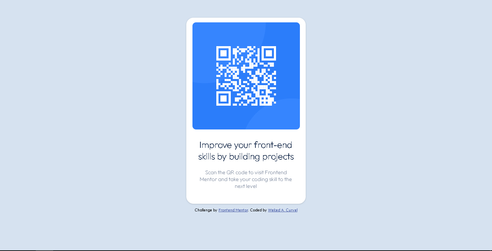
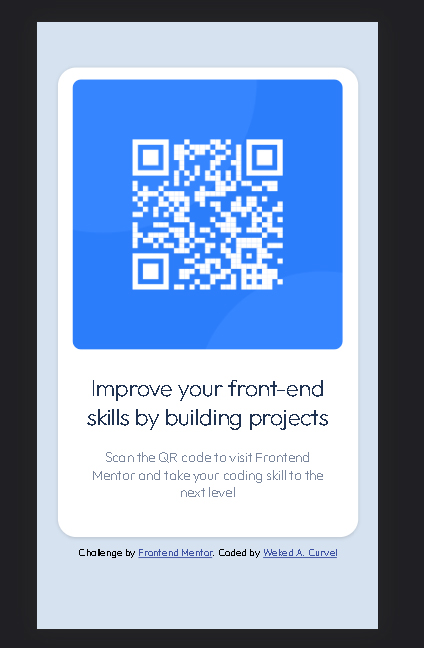

# Frontend Mentor - QR code component solution

This is a solution to the [QR code component challenge on Frontend Mentor](https://www.frontendmentor.io/challenges/qr-code-component-iux_sIO_H). Frontend Mentor challenges help you improve your coding skills by building realistic projects. 

## Table of contents

- [Overview](#overview)
  - [Screenshot](#screenshot)
  - [Links](#links)
- [My process](#my-process)
  - [Built with](#built-with)
  - [What I learned](#what-i-learned)
  - [Continued development](#continued-development)
  - [Useful resources](#useful-resources)
- [Author](#author)

## Overview

This project is an implementation of the challenge proposed by the Frontend Mentor platform in order to test and improve my skills
as a developer. This project is about a component that presents the user with a QR code capable of directing him to the 
platform mentioned above.

### Screenshot




### Links

- Solution URL: [Add solution URL here](https://your-solution-url.com)
- Live Site URL: [Add live site URL here](https://your-live-site-url.com)

## My process

To build this project, I structured my development process as follows:

- Building the base structure of the HTML
- Verification of the semantics of the elements used and correction
- Resetting the spacing, margin and box-sizing settings of the elements
  through CSS reset.
- Creating the styles of the elements according to the design
  * Styles are implemented following the flow of the HTML document (top/bottom)
  * The classes are added following the previous idea

### Built with

- Semantic HTML5 markup
- CSS custom properties
- Flexbox
- Mobile-first workflow

### What I learned

The main learning curve in building these projects is certainly practice. Creating semantic structures and combining them with CSS styles is certainly quite a challenge for someone who is quite used to writing code in a programming language.

I believe that the item that most evolved my nuances as a frontend developer was the use of the flexbox. I could realize through this small project the importance that mastering such a CSS feature requires, especially when it comes to organizing elements within the page, or created elements.

```css
/*Simple use of flexbox to improve 
the image presentation on the card*/
.image-frame{
    display: flex;
    overflow: hidden;
    border-radius: 10px;
    margin-top: 4%;
}
```

### Continued development

The idea of this and future projects and implementations, is to develop my frontend skills, reinforcing the study of semantic structures in HTML and complex and lean stylesheets. In parallel to maintain the constant evolution of the domain of frontend and backend programming languages.

### Useful resources

- [CSS Scan](https://getcssscan.com/css-box-shadow-examples) - Learn the basics so you can use enablers like CSS Scan that provide nice shadows to use in layouts.

## Author

- Linkedin - [Weked A. Curvel](https://www.linkedin.com/in/weked)
- Github - [Weked](https://www.github.com/Weked)
- Frontend Mentor - [@Weked](https://www.frontendmentor.io/profile/Weked)